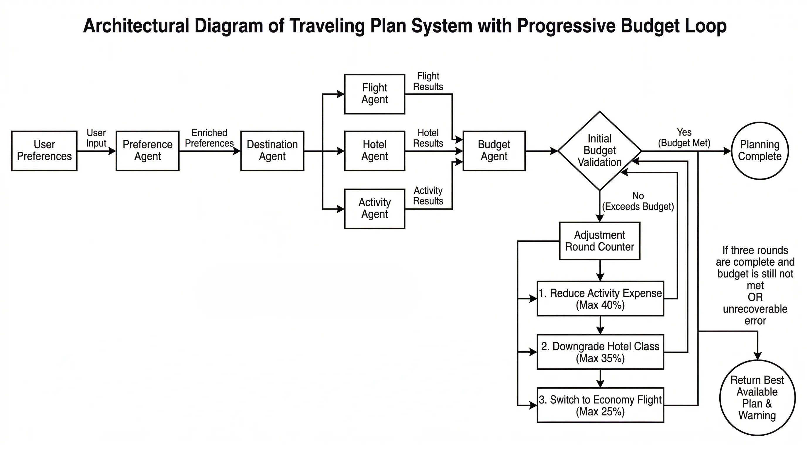

# Multi-Agent Travel Planner

This project is based on bcefghj/multi-agent-travel-planner. I have modified the Streamlit module and will continue to update and optimize other functions. Stay tuned!

---

## 1. 项目概述
基于**多智能体（Multi-Agent）**架构实现的智能旅行规划系统，支持用户偏好解析、目的地推荐、航班/酒店/活动搜索、预算自动校验与渐进式降级调整，提供一站式自动化行程规划能力。

本项目采用 **顺序流水线（偏好 → 目的地）+ 并行检索（航班 / 酒店 / 活动）+ 预算反馈循环（最多 3 轮）** 架构，所有 Agent 使用 Mock 数据，不依赖外部真实 API。

---

## 2. 架构设计

### 2.1 系统架构一句话（面试必背）
**Pipeline 串行前置依赖，CompletableFuture 并行缩短检索时间，Budget 循环在超支时抬高「预算压力等级」驱动 Mock 侧降价与减配。**

### 2.2 智能体设计（6大智能体 + 抽象基类）
系统采用**模板方法模式**统一智能体行为规范，共设计 6 个专业智能体完成分工协作：
- **BaseAgent**：所有智能体的抽象基类，定义统一执行流程
- **PreferenceAgent**：解析并 enriched 用户偏好，补充兴趣标签
- **DestinationAgent**：根据偏好推荐 3 个候选目的地 + 1 个最优推荐
- **FlightAgent**：航班搜索与价格获取
- **HotelAgent**：酒店搜索、等级与费用查询
- **ActivityAgent**：景点/活动推荐与费用计算
- **BudgetAgent**：费用汇总、预算校验与调整


### 2.3 核心包结构说明

| 包路径 | 职责 |
|--------|------|
| com.travel.agent | 各智能体：模板方法基类 + 具体 Agent |
| com.travel.orchestrator | ParallelExecutor、BudgetLoopController、TravelPlanningPipeline |
| com.travel.model | 领域 / 传输模型 |
| com.travel.service | 应用服务，封装用例 |
| com.travel.controller | REST 入口 |
| com.travel.config | 线程池等基础设施配置 |

---

## 3. 核心流程

### 3.1 数据流流程
1. 用户偏好输入
2. 偏好智能体增强用户画像
3. 目的地智能体生成推荐
4. 并行调用航班/酒店/活动智能体搜索资源
5. 预算智能体汇总费用并生成预算明细
6. 返回最终旅行方案

### 3.2 预算循环（渐进式降级策略）
1. 初始预算校验
2. 超预算 → 第一轮：削减活动费用（最高 40%）
3. 仍超支 → 第二轮：降低酒店等级（最高 35%）
4. 仍超支 → 第三轮：更换经济航班（最高 25%）
5. 三轮后仍不满足 → 返回当前最优方案 + 预算警告

---

## 4. 技术特点
- 多智能体分工协作，职责单一、易于扩展
- 基于模板方法模式统一智能体行为
- 并行资源搜索，提升系统响应速度
- 自动化预算循环与降级，无需人工干预
- 模块化设计，结构清晰，便于二次开发

---

## 5. 环境要求
- JDK 21
- Maven 3.9+（支持 Maven Wrapper）

---

## 6. 构建与运行

### 构建
```bash
./mvnw -q clean package -DskipTests
运行
./mvnw spring-boot:run
```
启动端口：8080

---

## 7. API 说明
健康检查
```bash
   GET http://localhost:8080/api/health
```
生成行程
```bash
   POST http://localhost:8080/api/plan
   Content-Type: application/json
```

示例请求：
```bash
   json
   {
   "budget": 15000,
   "style": "BUDGET_FRIENDLY",
   "startDate": "2026-05-01",
   "endDate": "2026-05-05",
   "departureCity": "上海",
   "travelers": 2,
   "interests": ["美食", "博物馆"]
   }
```

---

## 8. 更新说明
   ✅ 已完成：Streamlit 展示模块改造

   🔄 进行中：业务逻辑优化、智能体增强、预算循环调整、API 调用......

   📌 敬请期待更多功能更新！
